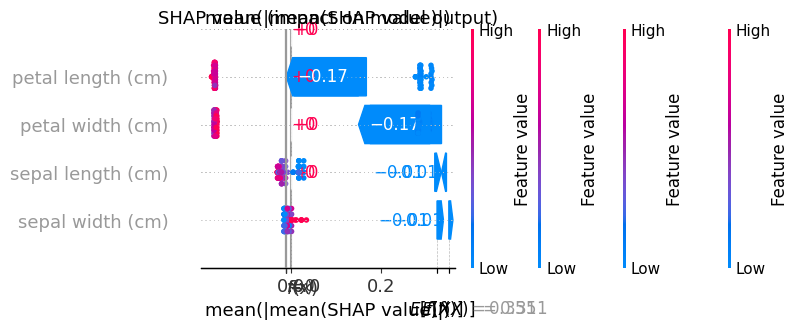
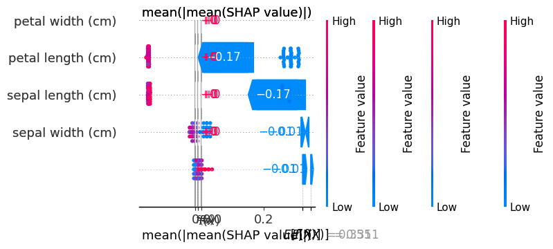

## # 🧠 Explainable AI on Iris Dataset

This project demonstrates the use of SHAP and LIME to interpret predictions made by a RandomForestClassifier trained on the Iris dataset.

---

## ✅ Model Summary

- **Model**: `RandomForestClassifier`
- **Dataset**: Iris (3-class classification: Setosa, Versicolor, Virginica)
- **Train/Test Split**: 80% train, 20% test
- **Test Accuracy**: `1.00 (100%)`
- **Saved Model**: `model/random_forest_model.joblib`

---

## 📈 Evaluation Metrics

The model performs perfectly on the test set:

### 🔹 Accuracy
`1.00`

### 🔹 Classification Report

| Class       | Precision | Recall | F1-Score | Support |
|-------------|-----------|--------|----------|---------|
| Setosa      | 1.00      | 1.00   | 1.00     | 10      |
| Versicolor  | 1.00      | 1.00   | 1.00     | 9       |
| Virginica   | 1.00      | 1.00   | 1.00     | 11      |

- **Macro Avg**: Precision = 1.00, Recall = 1.00, F1 = 1.00
- **Weighted Avg**: Same as above

### 🔹 Confusion Matrix
[[10 0 0]
[ 0 9 0]
[ 0 0 11]]

## 📊 SHAP Global Explanations

SHAP (SHapley Additive exPlanations) helps understand how much each feature contributes to model predictions.

### 🔷 Beeswarm Plot (Class 0 - Setosa)

Shows feature impact across multiple samples.

- Dominant features: Petal length, Petal width

### 🔶 Bar Plot

Bar plot of average absolute SHAP values

### 🔁 Waterfall Plot

For a single test instance, shows how each feature pushes the prediction higher or lower.

---

## 🔍 LIME Local Explanation

LIME (Local Interpretable Model-agnostic Explanations) shows how a specific prediction was made.

- Explained a test instance predicted as **Versicolor**.
- Influencing features (positively or negatively) included:
  - `petal length > 4.25`
  - `petal width > 0.30`
  - `sepal width <= 2.80`, etc.

